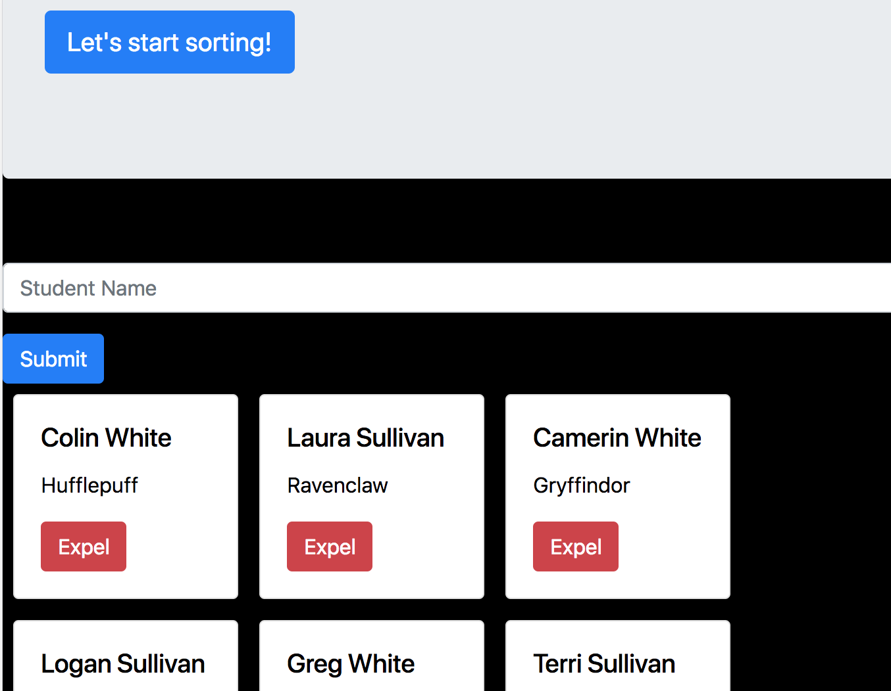

# Sorting Hat

# Technologies Used:

    1. HTML5, CSS, JavaScript, Bootstrap 4

# Description 

We were in charge of bringing the Hogwarts sorting hat to life!

To start off with, we used a bootstrap jumbotron to have our sorting hat introduce itself and start the sorting process (by clicking on a button). A bootstrap form appeared to fill in the student's name and a button to sort. This assigned the student to a random house (Gryffindor, Hufflepuff, Ravenclaw, or Slytherin). On sorting a student, the form cleared and a bootstrap card with the student's name and house printed below the form. You can expel a student after they have been sorted, which removes their card from the student record.

# Screenshots

# Instructions 

1. Go to: `https://www.npmjs.com/package/http-server` and install "http-server".  
2. Navigate to the project folder in command line interface and type: `http-server -p 8080`  
3. This will show at: `http://localhost:8080` in your internet browser.  